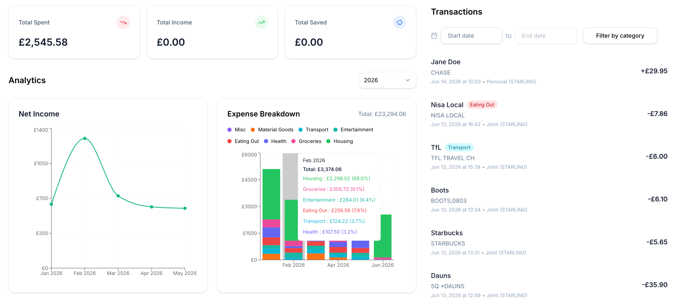

# Spendless

A personal finance tracker that connects to bank data via TrueLayer. Aggregates all your transaction history to one place so it's easy to keep track on what you're spending.

Full disclosure: I'm not a front end engineer, so the dashboard UI has been vibe coded

## Deployment

The application is available as a prebuilt Docker image on Docker Hub:

[Docker image](https://hub.docker.com/r/tjgohil/spendless)
